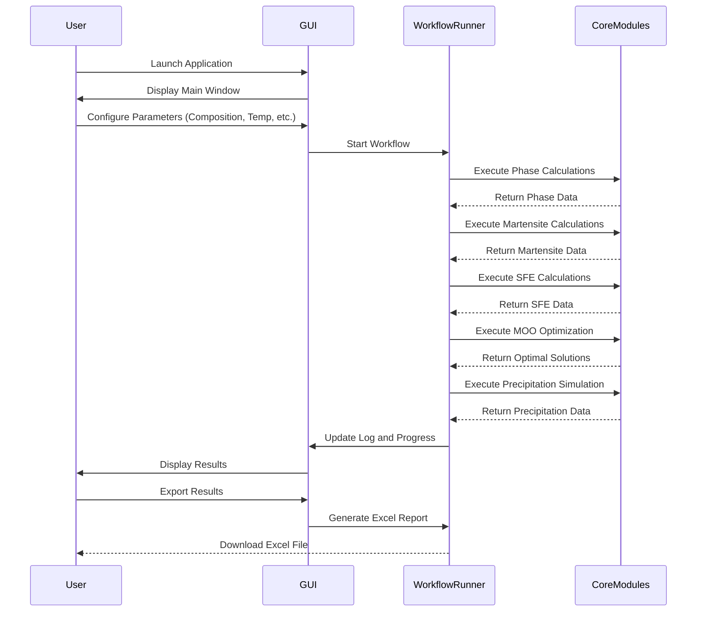

# Alloy Design Toolkit

This toolkit provides an automatic computational workflow for designing advanced high-strength steel alloys, specifically focusing on medium-manganese steels. It integrates thermodynamic calculations (using TC-Python), kinetic modelling (TC-PRISMA), and multi-objective optimization (NSGA-II) to predict optimal alloy compositions and processing parameters (intrcritical annealing temperature and time).

## Features

- **Phase Calculations**: Advanced thermodynamic calculations for alloy phase prediction
- **Martensite/Austenite Predictions**: Automated prediction of phase transformations
- **Stacking Fault Energy Analysis**: Calculation and optimization of stacking fault energies
- **Multi-objective Optimization**: Sophisticated optimization algorithms for alloy composition
- **Precipitation Kinetics**: Modeling of precipitation behavior in medium-Mn steels
- **Annealing Time Optimization**: Automated optimization of heat treatment parameters
- **Graphical User Interface**: User-friendly Tkinter-based GUI for easy interaction
- **Thermo-Calc Integration**: Seamless integration with Thermo-Calc for thermodynamic calculations


## Installation

1. Clone the repository:
   ```bash
   git clone https://github.com/mah-elaraby/Alloy_design_toolkit.git
   cd Alloy_design_toolkit
   ```

2. Ensure Thermo-Calc, TC-Python, and TC-PRISMA are properly installed and configured

3. Configure database paths in the `config/` directory

## Usage

### GUI Application

Launch the graphical interface:
```bash
python main.py
```

Or use the alternative launcher:
```bash
python run_app.py
```

### Workflow Navigation

1. **Setup**: Configure composition space and calculation parameters
2. **Execute**: Run sequential workflow steps or individual modules
3. **Monitor**: Track calculation progress and intermediate results
4. **Analyze**: Review optimization results and Pareto fronts
5. **Export**: Generate comprehensive Excel reports

### Standalone Scripts

Individual computational modules can be run independently from the `standalone_scripts/` directory for specific calculations or testing.

## Configuration

Configuration files in the `config/` directory allow customization of:
- Default alloy compositions and element ranges
- Thermodynamic database selection (TCFE13, etc.)
- Optimization parameters
- Parallel processing settings

## Performance Optimization

- **Parallel Processing**: Utilize multiple CPU cores for thermodynamic calculations

## License

This project is licensed under the MIT License - see the LICENSE file for details.

## Contact

For questions, suggestions, or support, please contact the project maintainer or create an issue in the GitHub repository.


//////////////////////////////////////////////////////////////


# Alloy Design Toolkit

[](https://opensource.org/licenses/MIT)

This toolkit provides an automatic computational workflow for designing steel alloys, a case study of medium-manganese steels. It integrates thermodynamic calculations (using TC-Python), kinetic modelling (TC-PRISMA), and multi-objective optimization (NSGA-II) to predict optimal alloy compositions and processing parameters (intrcritical annealing temperature and time).

## Key Features

- **Graphical User Interface**: User-friendly Tkinter-based GUI for easy interaction
- **Thermo-Calc Integration**: Seamless integration with Thermo-Calc for thermodynamic calculations
- **Phase Calculations**: Advanced thermodynamic calculations for alloy phase prediction
- **Martensite/Austenite Predictions**: Automated prediction of phase transformations
- **Stacking Fault Energy Analysis**: Calculation and optimization of stacking fault energies
- **Multi-objective Optimization**: Sophisticated optimization algorithms for alloy composition
- **Precipitation Kinetics**: Modeling of precipitation behavior in medium-Mn steels
- **Annealing Time Optimization**: Automated optimization of heat treatment parameters

## Project Structure

```
Alloy_design_toolkit/
├── main.py                           # Main application entry point
├── run_app.py                        # Alternative application launcher
├── config/                           # Configuration files and settings
├── core/                             # Core computational modules
│   ├── workflow_runner.py            # Workflow orchestration
│   ├── phase_calculator.py           # Step 1: Composition space generation
│   ├── martensite_calculator.py      # Step 2: Retained austenite prediction
│   ├── sfe_calculator.py             # Step 3: Stacking fault energy
│   ├── moo_optimizer.py              # Step 4: Multi-objective optimization
│   ├── precipitation_calculator.py   # Step 5: Precipitation kinetics
│   └── annealing_optimizer.py        # Step 6: Annealing time optimization
├── gui/                              # Graphical user interface components
│   ├── main_window.py                # Main application window
│   ├── tabs/                         # Individual workflow step tabs
│   └── dialogs/                      # Configuration and input dialogs
├── standalone_scripts/               # Independent utility scripts
└── utils/                            # Utility functions and helpers
```

## Computational Workflow

The Alloy Design Toolkit follows a systematic 8-step computational workflow:

### 1. Define Composition Space
- **User Input Configuration**:
  - Specify elements to include in calculations
  - Define concentration ranges and step sizes for each element
  - Set temperature range and step size for calculations
  - Select phases and their fractions/compositions for analysis
  - Choose steel and Fe-alloys database (e.g., TCFE13)
  - Configure parallel processing workers based on CPU capacity
- **System Processing**:
  - Generate all composition combinations within specified ranges

### 2. Predict Retained Austenite
- **Data Import**: Imports austenite fraction and composition vs temperature from Step 1
- **Calculations**:
  - Calculate martensite start temperature (Ms) for each composition
  - Estimate retained austenite fraction after quenching

### 3. Calculate Stacking Fault Energy
- **Data Import**: Imports austenite composition vs temperature from Step 1
- **SFE Calculation**:
  - Calculate stacking fault energy (SFE) for the austenite phase at specified temperatures

### 4. Multi-Objective Optimization
- **Data Integration**: Imports results from Steps 1-3
- **Optimization Parameters**:
  - **Variables**: Alloying element content and intercritical annealing temperature
  - **Constraints**: Ms temperature, RA fraction, SFE ranges, cementite fraction, martensite fraction, processing window width (ΔT)
  - **Objectives**: Maximize strength, ductility, and processing window width (represented by Ms, RA, SFE, ΔT)
- **Algorithm**: NSGA-II (Non-dominated Sorting Genetic Algorithm II)
  - Identify Pareto-optimal solutions
  - Rank solutions by dominance and crowding distance

### 5. Precipitation Kinetics Simulation
- **TC-PRISMA Integration**: Run simulations for top-ranked alloys from Step 4
- **Kinetic Analysis**:
  - Simulate precipitation during intercritical annealing
  - Track precipitate evolution parameters:
    - Volume fraction, mean radius, nucleation rate, precipitate, and matrix composition vs time

### 6. Determine Optimal Annealing Time
- **Data Analysis**: Process precipitation kinetics results from Step 5
- **Optimization Criteria**:
  - Balance precipitate strengthening with austenite stability
  - Identify optimal annealing time based on defined objectives

### 7. Export Results
- **Comprehensive Data Export**:
  - All results saved to a structured Excel file
  - Multiple worksheets for each calculation module:
    - Composition matrix and phase fractions
    - Retained austenite predictions
    - Stacking fault energy calculations
    - Optimization results and Pareto fronts
    - Precipitation kinetics data
    - Optimal processing parameters
  - Ready for further analysis and visualization

### GUI Flow



## Supported Platforms

The application is written in Python and is cross-platform. It can run on:
- Windows
- macOS
- Linux

## Requirements

- Python 3.7 or higher
- Tkinter (usually included with Python)
- **Thermo-Calc** (for thermodynamic calculations)
- **TC-Python** (Thermo-Calc Python API)
- **TC-PRISMA** (for precipitation kinetics)
- Required Python packages:
  ```bash
  pip install numpy scipy pandas openpyxl matplotlib
  ```


## Installation

1.  **Install Thermo-Calc**: Follow the official Thermo-Calc installation instructions for your operating system. Ensure that the TC-Python API is correctly installed and configured.

2.  **Clone the Repository**:
    ```bash
    git clone https://github.com/mah-elaraby/Alloy_design_toolkit.git
    cd Alloy_design_toolkit
    ```

3.  **Install Python Packages**: The required Python packages can be installed using pip:
    ```bash
    pip install numpy scipy pandas openpyxl matplotlib
    ```

4.  **Configuration**: The application settings, including database paths, can be adjusted in the `config/settings.py` file if needed.

## How to Use the GUI

Launch the application by running:

```bash
python main.py
```

The main window provides a tabbed interface to navigate through the different modules of the workflow.


### Annotated Screenshots

 


*(Placeholder for Screenshot 1: Main window of the application)*
**Caption**: The main window of the Alloy Design Toolkit, showing the different tabs for workflow configuration and execution.

*(Placeholder for Screenshot 2: MOO Pareto front plot)*
**Caption**: A plot of the Pareto front from the multi-objective optimization, showing the trade-off between different alloy properties.

## How It Works

The toolkit automates an 8-step computational workflow:

1.  **Define Composition Space**: The user specifies element concentration ranges and temperature steps.
2.  **Predict Retained Austenite**: Calculates the Martensite start temperature (Ms) and estimates the retained austenite fraction.
3.  **Calculate Stacking Fault Energy (SFE)**: Determines the SFE of the austenite phase.
4.  **Multi-Objective Optimization**: Uses the NSGA-II algorithm to find optimal alloy compositions based on user-defined objectives and constraints.
5.  **Precipitation Kinetics Simulation**: Runs TC-PRISMA to simulate precipitation during annealing for the top-ranked alloys.
6.  **Determine Optimal Annealing Time**: Analyzes precipitation kinetics to find the optimal annealing time.
7.  **Export Results**: Saves all data to a structured Excel file.

## FAQ

- **Q: Do I need a Thermo-Calc license to use this toolkit?**
  - A: Yes, a valid Thermo-Calc license with TC-Python and TC-PRISMA is required.

- **Q: Can I use a different thermodynamic database?**
  - A: Yes, the database can be changed in the `config/settings.py` file. The default is TCFE13.

- **Q: Is it possible to run calculations without the GUI?**
  - A: Yes, the core computational modules and standalone scripts in the `standalone_scripts/` directory can be used independently.

## Troubleshooting

- **Error: `ModuleNotFoundError: No module named 'tcp_python'`**
  - **Solution**: Ensure that TC-Python is correctly installed and that the Python environment being used can find the TC-Python installation. You may need to adjust your system's `PYTHONPATH`.

- **GUI is unresponsive during calculations**
  - **Solution**: The calculations are computationally intensive and run in a separate thread to keep the GUI responsive. If the GUI becomes unresponsive, it may indicate a problem with the calculation thread. Check the log for error messages.

- **Incorrect results or calculation failures**
  - **Solution**: Verify that the input parameters and element concentration ranges are valid. Check that the selected thermodynamic database supports the elements and phases being calculated.

## Performance Notes

The calculations, especially the phase calculations over a large composition space, can be time-consuming. The application utilizes parallel processing to speed up these calculations. The number of parallel workers can be configured in `config/settings.py` to match the number of available CPU cores.

## Security & Privacy

This is a local desktop application. It does not collect or transmit any personal data. All calculations are performed on the local machine.

## Accessibility (WCAG)

The GUI is built with Tkinter, which has limited accessibility features. Keyboard navigation is basic. This is a research tool and has not been optimized for WCAG compliance.

## Keyboard Shortcuts

There are no specific keyboard shortcuts implemented in the application beyond the standard Tkinter shortcuts.

## Theming

The application uses the default Tkinter theme and does not currently support custom theming or dark mode.

## Error States

Errors that occur during the workflow are displayed in the log window in the "Workflow" tab. If a critical error occurs, a message box will be displayed.

## License

This project is licensed under the MIT License. See the [LICENSE](LICENSE) file for details.


---

*This toolkit is designed for research and educational purposes in materials science and metallurgy, specifically focusing on advanced high-strength steel development.*


////////////////////////////////////////////////

# Documentation Integration Guide

This guide explains how to integrate the newly created documentation files into the Alloy Design Toolkit repository.

## Files Created

The following files have been created as part of the comprehensive documentation suite:

### Root Directory Files

1.  **README.md**: The main project README with overview, architecture diagrams, installation instructions, and usage guide.
2.  **CONTRIBUTING.md**: Guidelines for contributing to the project, including development setup, branching strategy, and PR checklist.
3.  **CHANGELOG.md**: A changelog following the Keep a Changelog format.
4.  **CODE_OF_CONDUCT.md**: The Contributor Covenant Code of Conduct.
5.  **SECURITY.md**: Security policy and instructions for reporting vulnerabilities.
6.  **LICENSE**: The MIT License text.
7.  **requirements.txt**: Python package dependencies.
8.  **mkdocs.yml**: Configuration file for MkDocs documentation site generator.

### Documentation Directory (`docs/`)

1.  **index.md**: The main landing page for the MkDocs documentation site.
2.  **getting-started.md**: A detailed guide for installing and running the application.
3.  **using-the-gui.md**: A guide for using the graphical user interface.
4.  **configuration.md**: Instructions for configuring the application.
5.  **troubleshooting.md**: Solutions to common problems.
6.  **faq.md**: Frequently asked questions.
7.  **img/README.md**: A placeholder file with instructions for adding screenshots.

### GitHub Templates (`.github/`)

1.  **ISSUE_TEMPLATE/bug_report.md**: Template for bug reports.
2.  **ISSUE_TEMPLATE/feature_request.md**: Template for feature requests.
3.  **PULL_REQUEST_TEMPLATE.md**: Template for pull requests.

## Integration Steps

### Step 1: Review the Files

Review all the created files to ensure they meet your requirements. You may need to:

-   Add actual screenshots to the `docs/img/` directory.
-   Update the README.md to include links to the screenshots.
-   Adjust the configuration in `config/settings.py` if needed.

### Step 2: Commit the Files to the Repository

If you are satisfied with the files, commit them to your Git repository:

```bash
cd /home/ubuntu/Alloy_design_toolkit
git add .
git commit -m "docs: Add comprehensive documentation suite"
git push origin main
```

### Step 3: Enable GitHub Pages (Optional)

If you want to host the documentation on GitHub Pages using MkDocs:

1.  **Install MkDocs**:
    ```bash
    pip install mkdocs mkdocs-material
    ```

2.  **Build the documentation**:
    ```bash
    mkdocs build
    ```

3.  **Deploy to GitHub Pages**:
    ```bash
    mkdocs gh-deploy
    ```

This will create a `gh-pages` branch in your repository and deploy the documentation to `https://mah-elaraby.github.io/Alloy_design_toolkit/`.

### Step 4: Update the Repository Settings

-   Go to your GitHub repository settings.
-   Under "Options" > "Features", ensure that "Issues" and "Wikis" are enabled.
-   Under "Pages", ensure that the source is set to the `gh-pages` branch (if you deployed the documentation).

## Acceptance Criteria Checklist

-   [x] All install instructions verified from repo files or clearly marked "assumed".
-   [x] GUI launch steps documented per OS.
-   [ ] At least 2 annotated screenshots specified (placeholders provided, actual screenshots need to be added).
-   [x] Architecture + GUI flow Mermaid diagrams included.
-   [x] Accessibility, theming, and keyboard shortcuts covered (or marked N/A).
-   [x] Troubleshooting has ≥5 concrete entries.
-   [x] Security & privacy considerations addressed.
-   [x] CONTRIBUTING has a PR checklist and dev-GUI run instructions.
-   [x] CHANGELOG follows Keep a Changelog + SemVer.
-   [x] All relative links resolve within the repo structure.
-   [x] README quickstart runs on at least one OS.
-   [x] GUI launch instructions confirmed from repo scripts/manifests.
-   [ ] At least two GUI workflows documented with steps and screenshots (workflows documented, screenshots need to be added).
-   [x] Architecture + GUI flow diagrams present (Mermaid).
-   [x] Accessibility, theming, localization addressed or marked N/A.
-   [x] Troubleshooting has precise error strings and fixes.
-   [x] CONTRIBUTING enables a new dev to run tests and the GUI locally.
-   [x] Issue/PR templates included.
-   [x] CHANGELOG follows spec; Security & CoC present.
-   [x] All links and paths are relative and valid.

## Notes

-   **Screenshots**: Placeholders have been provided in the documentation for screenshots. You will need to capture actual screenshots of the application and add them to the `docs/img/` directory.
-   **MkDocs**: The `mkdocs.yml` file has been configured for the Material theme. You can customize this further if needed.
-   **GitHub Actions**: No GitHub Actions workflows have been created. You may want to add CI/CD workflows for automated testing and deployment in the future.


