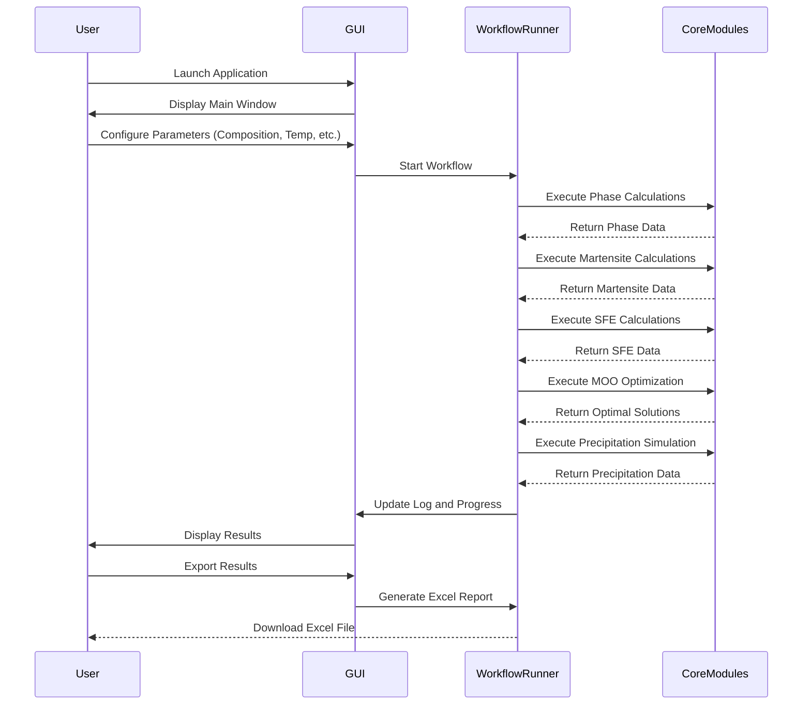

# Alloy Design Toolkit

[](https://opensource.org/licenses/MIT)

This toolkit provides an automatic computational workflow for designing steel alloys, a case study of medium-manganese steels. It integrates thermodynamic calculations (using TC-Python), kinetic modelling (TC-PRISMA), and multi-objective optimization (NSGA-II) to predict optimal alloy compositions and processing parameters (intrcritical annealing temperature and time).

## Key Features

- **Graphical User Interface**: User-friendly Tkinter-based GUI for easy interaction
- **Thermo-Calc Integration**: Seamless integration with Thermo-Calc for thermodynamic calculations
- **Phase Calculations**: Advanced thermodynamic calculations for alloy phase prediction
- **Martensite/Austenite Predictions**: Automated prediction of phase transformations
- **Stacking Fault Energy Analysis**: Calculation and optimization of stacking fault energies
- **Multi-objective Optimization**: Sophisticated optimization algorithms for alloy composition
- **Precipitation Kinetics**: Modeling of precipitation behavior in medium-Mn steels
- **Annealing Time Optimization**: Automated optimization of heat treatment parameters

## Project Structure

```
Alloy_design_toolkit/
├── main.py                           # Main application entry point
├── run_app.py                        # Alternative application launcher
├── config/                           # Configuration files and settings
├── core/                             # Core computational modules
│   ├── workflow_runner.py            # Workflow orchestration
│   ├── phase_calculator.py           # Step 1: Composition space generation
│   ├── martensite_calculator.py      # Step 2: Retained austenite prediction
│   ├── sfe_calculator.py             # Step 3: Stacking fault energy
│   ├── moo_optimizer.py              # Step 4: Multi-objective optimization
│   ├── precipitation_calculator.py   # Step 5: Precipitation kinetics
│   └── annealing_optimizer.py        # Step 6: Annealing time optimization
├── gui/                              # Graphical user interface components
│   ├── main_window.py                # Main application window
│   ├── tabs/                         # Individual workflow step tabs
│   └── dialogs/                      # Configuration and input dialogs
├── standalone_scripts/               # Independent utility scripts
└── utils/                            # Utility functions and helpers
```

## Computational Workflow

The Alloy Design Toolkit follows a systematic 8-step computational workflow:

### 1. Define Composition Space
- **User Input Configuration**:
  - Specify elements to include in calculations
  - Define concentration ranges and step sizes for each element
  - Set temperature range and step size for calculations
  - Select phases and their fractions/compositions for analysis
  - Choose steel and Fe-alloys database (e.g., TCFE13)
  - Configure parallel processing workers based on CPU capacity
- **System Processing**:
  - Generate all composition combinations within specified ranges

### 2. Predict Retained Austenite
- **Data Import**: Imports austenite fraction and composition vs temperature from Step 1
- **Calculations**:
  - Calculate martensite start temperature (Ms) for each composition
  - Estimate retained austenite fraction after quenching

### 3. Calculate Stacking Fault Energy
- **Data Import**: Imports austenite composition vs temperature from Step 1
- **SFE Calculation**:
  - Calculate stacking fault energy (SFE) for the austenite phase at specified temperatures

### 4. Multi-Objective Optimization
- **Data Integration**: Imports results from Steps 1-3
- **Optimization Parameters**:
  - **Variables**: Alloying element content and intercritical annealing temperature
  - **Constraints**: Ms temperature, RA fraction, SFE ranges, cementite fraction, martensite fraction, processing window width (ΔT)
  - **Objectives**: Maximize strength, ductility, and processing window width (represented by Ms, RA, SFE, ΔT)
- **Algorithm**: NSGA-II (Non-dominated Sorting Genetic Algorithm II)
  - Identify Pareto-optimal solutions
  - Rank solutions by dominance and crowding distance

### 5. Precipitation Kinetics Simulation
- **TC-PRISMA Integration**: Run simulations for top-ranked alloys from Step 4
- **Kinetic Analysis**:
  - Simulate precipitation during intercritical annealing
  - Track precipitate evolution parameters:
    - Volume fraction, mean radius, nucleation rate, precipitate, and matrix composition vs time

### 6. Determine Optimal Annealing Time
- **Data Analysis**: Process precipitation kinetics results from Step 5
- **Optimization Criteria**:
  - Balance precipitate strengthening with austenite stability
  - Identify optimal annealing time based on defined objectives

### 7. Export Results
- **Comprehensive Data Export**:
  - All results saved to a structured Excel file
  - Multiple worksheets for each calculation module:
    - Composition matrix and phase fractions
    - Retained austenite predictions
    - Stacking fault energy calculations
    - Optimization results and Pareto fronts
    - Precipitation kinetics data
    - Optimal processing parameters
  - Ready for further analysis and visualization

### GUI Flow



## Supported Platforms

The application is written in Python and is cross-platform. It can run on:
- Windows
- macOS
- Linux

## Requirements

- Python 3.7 or higher
- Tkinter (usually included with Python)
- **Thermo-Calc** (for thermodynamic calculations)
- **TC-Python** (Thermo-Calc Python API)
- **TC-PRISMA** (for precipitation kinetics)
- Required Python packages:
  ```bash
  pip install numpy scipy pandas openpyxl matplotlib
  ```


## Installation

1.  **Install Thermo-Calc**: Follow the official Thermo-Calc installation instructions for your operating system. Ensure that the TC-Python API is correctly installed and configured.

2.  **Clone the Repository**:
    ```bash
    git clone https://github.com/mah-elaraby/Alloy_design_toolkit.git
    cd Alloy_design_toolkit
    ```

3.  **Install Python Packages**: The required Python packages can be installed using pip:
    ```bash
    pip install numpy scipy pandas openpyxl matplotlib
    ```

4.  **Configuration**: The application settings, including database paths, can be adjusted in the `config/settings.py` file if needed.

## How to Use the GUI

Launch the application by running:

```bash
python main.py
```


### Annotated Screenshots

 

The main window of the Alloy Design Toolkit, showing the different tabs for workflow configuration and execution.


## FAQ

- **Q: Do I need a Thermo-Calc license to use this toolkit?**
  - A: Yes, a valid Thermo-Calc license with TC-Python and TC-PRISMA is required.

- **Q: Can I use a different thermodynamic database?**
  - A: Yes, the database can be changed in the `config/settings.py` file. The default is TCFE13.

- **Q: Is it possible to run calculations without the GUI?**
  - A: Yes, the core computational modules and standalone scripts in the `standalone_scripts/` directory can be used independently.

## Troubleshooting

- **Error: `ModuleNotFoundError: No module named 'tcp_python'`**
  - **Solution**: Ensure that TC-Python is correctly installed and that the Python environment being used can find the TC-Python installation. You may need to adjust your system's `PYTHONPATH`.

- **GUI is unresponsive during calculations**
  - **Solution**: The calculations are computationally intensive and run in a separate thread to keep the GUI responsive. If the GUI becomes unresponsive, it may indicate a problem with the calculation thread. Check the log for error messages.

- **Incorrect results or calculation failures**
  - **Solution**: Verify that the input parameters and element concentration ranges are valid. Check that the selected thermodynamic database supports the elements and phases being calculated.

## Performance Notes

The calculations, especially the phase calculations over a large composition space, can be time-consuming. The application utilizes parallel processing to speed up these calculations. The number of parallel workers can be configured in `config/settings.py` to match the number of available CPU cores.

## Security & Privacy

This is a local desktop application. It does not collect or transmit any personal data. All calculations are performed on the local machine.


## Error States

Errors that occur during the workflow are displayed in the log window in the "Workflow" tab. If a critical error occurs, a message box will be displayed.

## License

This project is licensed under the MIT License. See the [LICENSE](LICENSE) file for details.


